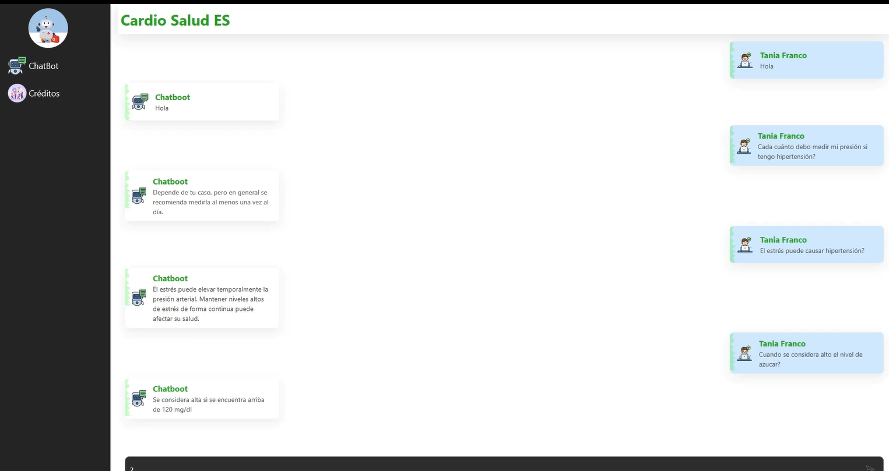

# Analisis de Prediccion de Hipertensión

La hipertensión arterial es un problema de salud significativo en El Salvador. Según datos disponibles, la prevalencia de hipertensión en adultos salvadoreños es alta, afectando a una proporción considerable de la población. Por ejemplo, un estudio realizado en 2018 encontró que aproximadamente el 43.6% de los adultos evaluados presentaban prehipertensión, y una parte significativa ya era diagnosticada como hipertensa. Además, las enfermedades cardiovasculares, relacionadas con la hipertensión, son una de las principales causas de muerte en el país.

Por lo tanto, se presenta un modelo de inteligencia artificial capaz de predecir con precision la posibilidad de padecer hipertension, ayudando asi a todos los salvadoreños a cuidar su salud.
Ademas, se presenta un chatbot entrenado para facilitar la interaccion con el usuario.

## Tabla de contenidos

1. [Nombre](#Nombre)
2. [Descripción](#descripción)
3. [Arquitectura](#Arquitectura)
4. [Proceso](#Proceso)
5. [Funcionalidades](#Funcionalidades)
6. [Estado del proyecto](#EstadoDelProyecto)
7. [Agradecimientos](#Agradecimientos)

* Nombre del proyecto

Analisis de Prediccion de Hipertensión
Cardio Salud ES

* Breve descripción del proyecto -> Alguna imagen o gif que muestre el proyecto

Se presenta un modelo de prediccion categorico donde, a partir de ciertas caracteristicas, predice si el usuario tiene hipertension o no. Ademas, se implementa un chatbot entrenado que facilite la aplicacion del modelo antes mencionado.

* Arquitectura del proyecto + imagen

El modelo de IA utiliza diferentes tecnicas aprendidas durante el curso, dentro de las cuales estan:
    - Analisis y limpieza de datos
    - Escalado de datos con MinMaxScaler
    - Aplicacion del modelo XGBClassifier
    - Utilizacion de GridSearch para encontrar los mejores hiperparametros

La pagina web se realizo con las siguientes herramientas:
    - Laravel PHP para la gestion de logica del servidor y la interaccion con la base de datos.
    - MySQL base de datos relacional 
    - FrontEnd con React (Framework de JS)

* Proceso de desarrollo:

-Fuente del dataset

data = kagglehub.dataset_download("prosperchuks/health-dataset")
file_path = os.path.join(data, "hypertension_data.csv")

-Limpieza de datos (img que lo valide)

    - Validacion de datos null
    - Validacion de datos duplicados
    - Eliminar columnas innecesarias para el modelo
    - Escalar magnitudes para evitar sesgo 
    -Implementacion de GridSearch

-Manejo excepciones/control errores

    - Se eliminan los posibles errores en la limpieza de los datos

-Estadísticos (Valores, gráficos, …)

    - Se incluyen el analisis de correlacion de los datos
    - Se realiza la matriz de confusion del modelo entrenado
    - Precisión del modelo: 96%

* Funcionalidades extra:

    - Se ha realizado un chatbot entrenado que facilite la interaccion del usuario.
    - El chatbot ha sido entrenado con conversaciones especificas para la implementacion del modelo.
    - El sitio web es capaz de guardar historicos de conversaciones y resultados.
    - Se crea un sitio web que presente al chatbot de forma atractiva.

* Estado de proyecto: COMPLETADO.

* Agradecimientos: 

El equipo de Educando agradece a todos los miembros del Samsung Innovation Campus que hacen posible la realizacion de estas certificaciones, que permiten que muchos estudiantes como nosotros se desarrollen tanto personal como profesionalmente.
El proyecto se dedica a cada una de nuestras familias, por su amor y apoyo incondicional.